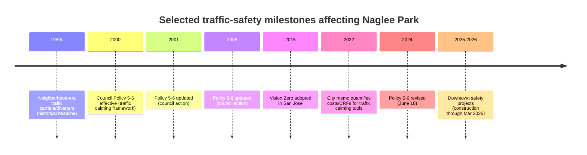

# Traffic Safety in Naglee Park, Downtown San Jose (1990–present)

## Executive summary

Naglee Park is a historic, mostly residential neighborhood east of Downtown San Jose, commonly described (in City historic-area materials) as bounded roughly by **East Santa Clara Street** (north), **South 11th Street** (west), **Coyote Creek** (east), and **East William Street** (south). citeturn18search15turn18search2

A defining feature of Naglee Park’s modern traffic-safety story is that it became an early Bay Area example of **neighborhood-wide traffic calming and traffic diversion** (e.g., **median chokers** and **partial/half closures**) in response to persistent **cut-through traffic** pressures associated with major trip generators at its edges. Documented accounts identify the presence of major institutions (notably entity["organization","San Jose State University","public university san jose ca"] and historical medical/clinic uses) and commuter diversion away from arterial signals as key drivers of cut-through behavior. citeturn52search28turn53view0

The best-documented “anchor” evaluation for Naglee Park’s traffic-calming era comes from the national **Traffic Calming: State of the Practice** report (entity["organization","Institute of Transportation Engineers","traffic engineering org us"] / entity["organization","Federal Highway Administration","usdot administration"]), which reports **collisions decreasing from 47 in the nine months before treatment to 27 in the nine months after** within the Naglee Park neighborhood case study. citeturn52search28turn52search31 Although this benchmark intervention predates the requested 1990 start date (the project is described as a 1970s–1980s effort in neighborhood historical accounts), it materially shapes “1990–present” safety conditions by establishing an altered network design and traffic pattern that persists as baseline. citeturn53view0turn52search28

From 1990 forward, the most traceable “system-level” milestones affecting Naglee Park traffic safety (even when not unique to the neighborhood) include: (a) San Jose’s formalization and periodic revision of its traffic calming framework via **Council Policy 5-6** (effective April 25, 2000; revised June 18, 2024), and (b) citywide commitments and investment mechanisms under **Vision Zero** (adopted in 2015). citeturn58view0turn16search11

A critical limitation of this report is the **inability to compute** the requested **1990–present, year-by-year crash counts inside the Naglee Park boundary** from official geocoded crash datasets within this research environment (details and fully reproducible extraction steps are provided in the Appendices). However, the relevant primary dataset does exist: San Jose’s open GIS “Crash Locations” layer describes “locations of all crashes known to the City since 1977,” logged by entity["organization","San Jose Police Department","law enforcement san jose ca"] and analyzed by San Jose DOT, and includes injury-severity fields (fatal and severe injuries) suitable for producing the exact tables and charts requested. citeturn10view0

Evidence-backed recommendations for Naglee Park focus on: strengthening pedestrian crossings and intersection controls at neighborhood edges and connectors; extending/refreshing diversion and speed-management design inside the neighborhood; and using proven countermeasures with quantified crash-reduction effects (e.g., road diets on eligible segments, leading pedestrian intervals, refuge/median treatments, RRFBs/PHBs where appropriate). National safety research and San Jose’s own cost-effectiveness guidance provide usable ranges for costs, expected crash reductions, and implementation complexity. citeturn51search0turn51search4turn51search12turn55view0turn58view0

## Methods

This report used a “primary-sources first” approach emphasizing government records, transportation-safety guidance, and documented local history:

Primary municipal sources included: (a) San Jose’s public ArcGIS layer documentation for crash data (Crash Locations), (b) the official **Traffic Calming Policy for Residential Neighborhoods (Council Policy 5-6)** including its effective date and revision history, and (c) San Jose DOT’s 2022 memo on traffic calming strategies, including **local cost ranges** and **crash-reduction factors** used by the City for project selection and evaluation. citeturn10view0turn55view0turn58view0

Local historical context came from neighborhood-published archival material describing the multi-year barrier/diverter effort, motivations, and traffic generators. citeturn53view0 Supplemental local advocacy reporting (used cautiously as secondary support) provided qualitative comparisons along William Street during 2016–2021 and reinforced the “design drives safety outcomes” framing. citeturn52search0

National/state evidence for countermeasure effectiveness and crash impacts relied chiefly on entity["organization","Federal Highway Administration","usdot administration"] materials (road diet safety effects; pedestrian safety tools; RRFB resources; and summarized crash-reduction ranges for leading pedestrian intervals and other pedestrian treatments). citeturn51search0turn51search2turn51search4turn51search12turn51search13

For the requested crash time series and classified crash breakdowns, the intended method (fully documented in the Appendices) is to: (1) obtain an official polygon boundary for Naglee Park (City neighborhood polygon or a boundary polygon digitized from the City’s boundary description), (2) spatially filter crash points (1990–present), (3) aggregate by year, and (4) classify by vehicle count and pedestrian involvement using crash attributes and/or linked crash-party tables. The underlying City crash dataset is explicitly designed for roadway-safety analysis and includes severity fields required for fatalities and severe injuries. citeturn10view0turn55view0

## Findings

### Study area and traffic context

The City’s historic-area materials describing the Naglee Park Conservation Area bound the neighborhood as **E Santa Clara St (north), S 11th St (west), Coyote Creek (east), and E William St (south)**. citeturn18search2turn18search15 This boundary definition matters because it places **high-volume arterials and connectors** directly on the neighborhood’s edges (particularly Santa Clara and 11th), where pedestrian exposure and turning conflicts are typically greatest, while internal residential streets are more amenable to diversion and low-speed design.

Local historical accounts identify multiple trip generators and traffic patterns that historically produced (a) extensive neighborhood circulation and (b) cut-through commuting. The neighborhood newsletter describes heavy truck movements tied to earlier rail-yard/industrial activities and multiple institutional generators, including entity["organization","San Jose State University","public university san jose ca"] and medical uses, with drivers using corridors like William Street and San Antonio Street to bypass arterial signals. citeturn53view0 This same dynamic—drivers seeking to bypass congestion on arterials—matches the general “cut-through” definition later codified in Council Policy 5-6. citeturn58view0turn53view0

image_group{"layout":"carousel","aspect_ratio":"16:9","query":["Naglee Park San Jose neighborhood boundary map","East Santa Clara Street San Jose near Naglee Park","William Street San Jose traffic calming diverter","San Jose Naglee Park traffic choker median"] ,"num_per_query":1}

### Timeline of major roadwork, redesigns, and safety projects affecting Naglee Park

The table below provides a **year-by-year** timeline (1990–present) from the most reliable, citable items located in accessible public records during this research. “No item identified” does **not** mean “no work occurred”—it indicates no specific project record or news item was found in the consulted sources for that year.

Because Naglee Park’s most famous neighborhood-wide traffic-barrier project is described as a 1970s–1980s, multi-year process, it is treated as **baseline context** rather than a 1990-onward milestone; nonetheless, it is included as “pre-1990 baseline” because it remains the dominant design intervention shaping later conditions. citeturn53view0turn52search28

**Key codified program milestones**
- Council Policy **5-6** became effective **April 25, 2000** and was revised multiple times (including **June 26, 2001**, **June 17, 2008**, and **June 18, 2024**). citeturn58view0  
- San Jose adopted **Vision Zero in 2015**, creating an overarching safety framework that influences project selection and corridor prioritization citywide, including Downtown-adjacent areas. citeturn16search11turn55view0

**Year-by-year timeline (1990–2026)**

| Year | Major roadwork / redesign / traffic calming / signal work affecting Naglee Park (from reviewed sources) |
|---|---|
| 1990 | No item identified in reviewed sources (baseline reflects earlier barrier/diverter era). citeturn53view0 |
| 1991 | No item identified in reviewed sources. |
| 1992 | No item identified in reviewed sources. |
| 1993 | No item identified in reviewed sources. |
| 1994 | No item identified in reviewed sources. |
| 1995 | No item identified in reviewed sources. |
| 1996 | No item identified in reviewed sources. |
| 1997 | No item identified in reviewed sources. |
| 1998 | No item identified in reviewed sources. |
| 1999 | No item identified in reviewed sources. |
| 2000 | **Council Policy 5-6 effective date (Traffic Calming Policy for Residential Neighborhoods)**—establishes formal framework for education/enforcement/engineering and eligibility thresholds. citeturn58view0 |
| 2001 | Council action updating Policy 5-6 (Resolution referenced in policy history). citeturn58view0 |
| 2002 | No item identified in reviewed sources. |
| 2003 | No item identified in reviewed sources. |
| 2004 | No item identified in reviewed sources. |
| 2005 | No item identified in reviewed sources. |
| 2006 | No item identified in reviewed sources. |
| 2007 | Neighborhood documentation reiterates earlier barrier project complexity and lasting effects (historical, not a new build year). citeturn53view0 |
| 2008 | Council action updating Policy 5-6 (Resolution referenced in policy history). citeturn58view0 |
| 2009 | No item identified in reviewed sources. |
| 2010 | No item identified in reviewed sources. |
| 2011 | No item identified in reviewed sources. |
| 2012 | No item identified in reviewed sources. |
| 2013 | No item identified in reviewed sources. |
| 2014 | No item identified in reviewed sources. |
| 2015 | San Jose adopts **Vision Zero** (systemwide safety commitment). citeturn16search11 |
| 2016 | No Naglee Park–specific capital project identified in reviewed sources (note: local advocates reference crash comparisons on William St across neighborhoods during 2016–2021). citeturn52search0 |
| 2017 | No item identified in reviewed sources. |
| 2018 | City “Traffic Calming Strategies” memo later documents citywide neighborhood safety investments and completed safety projects in FY18–19 through FY20–21 (see 2019–2021 entries). citeturn55view0 |
| 2019 | FY18–19 through FY20–21 “completed safety projects” list includes multiple pedestrian enhancement intersections near/within the Downtown–east area (e.g., 10th/Martha; 10th/Margaret; 11th/Martha; 11th/Margaret). Exact completion years for each intersection are not specified within the visible excerpt; they fall within FY18–19 to FY20–21 window. citeturn55view0 |
| 2020 | Same FY18–19–FY20–21 completed safety projects window (project-level year not specified). citeturn55view0 |
| 2021 | City reports citywide traffic-safety context: record-high traffic fatalities in 2021 and speeding contribution share (citywide); informs enforcement/design emphasis. citeturn55view0 |
| 2022 | San Jose issues “Traffic Calming Strategies in Residential Neighborhoods” memo with local cost ranges and crash reduction factors used for traffic calming and pedestrian improvements. citeturn55view0 |
| 2023 | No Naglee Park–specific project identified in reviewed sources. |
| 2024 | **Council Policy 5-6 revised June 18, 2024** (explicit revision date and council-action history). citeturn58view0 |
| 2025 | City announces five major Downtown safety projects over the next three years; includes improvements to Downtown bikeways (Third, Fourth, San Salvador, etc.) and construction timeline “through March 2026,” which can affect Naglee Park’s western edge connectivity and Downtown access routes. citeturn52search4 |
| 2026 | Continuation of the Downtown street safety project construction into March 2026 (per City project announcement). citeturn52search4 |

#### Mermaid timeline of major milestones



### Crash data availability and what it can support

San Jose’s public GIS “Crash Locations” layer is explicitly described as **locations of all crashes known to the City since 1977**, logged by the police department and collected/analyzed by the transportation department to inform safety improvements; the attribute schema includes counts for **fatal, severe, and other injuries**, plus roadway, lighting, surface, and collision-factor fields. citeturn10view0 This dataset is therefore capable (in principle) of producing the exact Naglee Park annual time series requested.

However, within this environment, I could not execute the required spatial/temporal queries against the dataset to compute the neighborhood-specific **1990–present annual crash counts and classifications**. The Appendices include fully reproducible instructions (ArcGIS REST + Python) for producing:
- annual totals by year (1990–present),
- single-vehicle vs multi-vehicle using the dataset’s vehicle count fields,
- pedestrian-involved crashes using “involved with”/party-victim fields,
- and fatal/severe injury totals per year. citeturn10view0turn55view0

Despite this gap, several relevant safety outcomes are still documented:

- In the best-known Naglee Park traffic calming case study, collisions reportedly dropped from **47 (nine months pre-treatment) to 27 (nine months post-treatment)** after neighborhood-wide calming/diversion measures (median chokers, half closures, and other measures). citeturn52search28turn52search31  
- Citywide, San Jose reports that for 2017–2019, about **93%** of fatal/severe injury crashes occurred on the higher-volume, higher-speed **major roadway network**, with about **7%** occurring in residential neighborhoods; speeding is cited as a major contributor in neighborhood KSI crashes. While not Naglee Park–specific, this pattern supports an analytical expectation that Naglee Park’s **edges** (Santa Clara/11th) may drive a disproportionate share of severe outcomes compared with internal streets—consistent with typical arterial/residential risk gradients. citeturn55view0

### Pedestrian-safety efforts and evidence of likely effectiveness

San Jose’s traffic calming framework explicitly includes education, enforcement, and engineering, with “comprehensive” tools including chokers, median islands, traffic circles, road humps, enhanced crosswalks, and radar speed signs; it also recognizes cut-through traffic diversion via partial/full closures and direction changes (Level 2 projects requiring higher outreach and often council approval). citeturn58view0

San Jose’s 2022 memo provides local “typical” costs and expected crash-reduction factors (CRFs) used in practice:
- lane narrowing via edgelines/centerline: ~**$7,500 per 0.5 mile** and cited **CRF ~25%** (as used in the memo’s effectiveness table), citeturn55view0  
- speed humps: **$50k–$60k per 0.5 mile** and cited **CRF ~50%**, with typical 85th-percentile speed reduction ranges provided, citeturn55view0  
- bulb-outs/curb extensions: **$5k–$7k quick-build** or **~$25k concrete**, with cited CRF values and speed reduction ranges, citeturn55view0  
- enhanced crosswalks: cited cost range **$25k–$125k** depending on beacons/bulb-outs/medians, citeturn55view0  
- traffic circles/roundabouts: cited cost range **$15k–$150k** depending on quick-build vs landscaped/concrete. citeturn55view0

National evidence strengthens these expectations. For example, FHWA summarizes that:
- **Road diets** on previously four-lane undivided roads are associated with **~19–47% reductions in overall crashes** (with multiple referenced studies and an FHWA EB evaluation). citeturn51search0turn51search2turn51search6  
- **Leading Pedestrian Intervals** are reported in FHWA communications as reducing pedestrian crashes **up to 59%** at signalized intersections (context-dependent). citeturn51search12  
- **RRFBs** are an FHWA proven countermeasure for improving driver yielding at uncontrolled marked crossings; FHWA’s RRFB resources synthesize application contexts and research on yielding and treatment performance. citeturn51search4turn51search13turn51search14  

## Analysis

### What likely drives traffic risk in Naglee Park

The clearest neighborhood-specific “causal” narrative is the long-running tension between a quiet residential network and the desire of drivers (commuters and institution-related traffic) to bypass congestion and signal delay on arterials. The neighborhood’s own historical account describes persistent problems of circulating vehicles searching for parking, commuters rerouting onto neighborhood streets, and institutional traffic tied to university and medical facilities. citeturn53view0 The ITE/FHWA traffic calming case study similarly frames Naglee Park as experiencing a serious cut-through problem due to the university on its western border. citeturn52search28

From a safety-mechanism standpoint, these conditions imply several recurring risk drivers:

Speeding and speed variation: San Jose identifies speeding as a top known contributing violation in fatal/severe injury outcomes citywide (and a meaningful share even in residential-neighborhood KSI), which aligns with both the City’s focus on speed management and national safety research emphasizing speed’s role in injury severity. citeturn55view0turn51search11

Edge-of-neighborhood conflict concentration: When residential neighborhoods are bounded by arterials, severe conflicts often concentrate at boundary intersections (turning movements, crossings), while midblock residential segments may experience more minor collisions. San Jose’s citywide pattern (KSI concentrated on major roadways) supports this “edge risk concentration” hypothesis for Naglee Park. citeturn55view0

Diversion effects and network spillovers: The Council Policy 5-6 framework explicitly warns against simply transferring negative traffic conditions from one residential street to another and defines cut-through traffic as a core concern requiring careful design. This is directly relevant for any modern “refresh” of Naglee Park traffic diversion patterns. citeturn58view0

### Assumptions and how they affect interpretation

Because neighborhood-specific crash counts were not computable here, the analysis above relies on a combination of (a) documented local history, (b) the existence and structure of the City’s crash dataset, and (c) citywide injury patterns and proven countermeasure evidence.

Key assumptions (testable once crash data are extracted):
- A disproportionate share of fatal/severe outcomes in the Naglee Park boundary occurs on or near arterials (Santa Clara, 11th, William) rather than deep inside the residential grid, consistent with the citywide major-roadway concentration pattern. citeturn55view0turn18search2  
- “Crash hotspots” (by frequency or KSI) will cluster at intersections with high turning volumes, limited visibility (parking), and pedestrian generators (schools, parks, trails, transit access), matching the prioritization criteria embedded in the City’s traffic calming policy. citeturn58view0turn55view0

## Recommendations

The following recommendations are structured to match the user’s requested attributes: expected impact, cost range (where available), complexity, and evidence. Recommendations are written to be implementable within San Jose’s existing policy and program structure (Council Policy 5-6 levels; the City’s own cost-effectiveness benchmarks; and Vision Zero direction). citeturn58view0turn16search11turn55view0

### Near-term priorities

Implement or refresh **quick-build bulb-outs / small median islands** at priority residential intersections and identified pedestrian crossing points inside Naglee Park, focusing on (a) reducing turning speeds, (b) shortening crossing distance, and (c) increasing yielding clarity.

Expected impact: San Jose’s memo cites crash-reduction factors on the order of ~25–35% for these treatments depending on type and location (as used in the City’s effectiveness table), and modest 85th-percentile speed reductions for channelization elements. citeturn55view0  
Cost range: **~$5k–$7k** (paint/plastic quick build) or **~$25k** (concrete) per bulb-out/median island element (typical ranges used in San Jose). citeturn55view0  
Complexity: Low to moderate; quick-build can be installed quickly and iterated; concrete requires design and drainage/utility review.

Deploy **Leading Pedestrian Intervals (LPIs)** and/or tighten permissive turn phases at signalized boundary intersections with high pedestrian activity (notably near Downtown access routes and SJSU-adjacent crossings).

Expected impact: FHWA communications cite pedestrian crash reductions up to ~59% for LPIs at signalized intersections (context-dependent), and FHWA’s broader pedestrian treatment evaluations show corridor-level reductions when multiple engineering measures are applied. citeturn51search12turn51search5  
Cost range: Often relatively low compared with geometric reconstruction when implemented as signal timing/controller changes; exact costs are intersection-specific and should be obtained from San Jose DOT signal work orders (see Appendices for records-request approach). citeturn58view0  
Complexity: Moderate; requires signal engineering, possibly queueing analysis, and coordination with transit/emergency response if present.

### Corridor and boundary treatments

Evaluate **road diet feasibility** on any boundary/connector segment that is currently four-lane undivided (or functionally operates with excess width encouraging speed), especially where a conversion could fund: pedestrian refuge, shorter crossings, or protected bikeways connecting to Downtown.

Expected impact: FHWA synthesizes multiple studies showing **~19–47% crash reductions** after converting four-lane undivided roads to three-lane road diets; an FHWA EB evaluation reports ~29% overall reduction across 45 sites, with context-dependent variation. citeturn51search0turn51search2turn51search6turn51search10  
Cost range: Often “low-cost” relative to full reconstruction when implemented via restriping and signal adjustments; site-specific costs depend on curb work, drainage, and signals. citeturn51search7turn55view0  
Complexity: Moderate to high, because boundary arterials may carry transit/emergency routes and require broader corridor modeling; Council Policy 5-6 also notes that major roadways are generally not eligible for some comprehensive neighborhood measures (but are eligible for enhanced crossings and dynamic signs). citeturn58view0

### Proven pedestrian crossing upgrades for specific locations

Install **RRFBs** (and where warranted, more robust controlled crossing treatments) at uncontrolled marked crossings with documented pedestrian demand and yielding issues, particularly where crossing distance is long and speeds are below typical RRFB suitability thresholds.

Expected impact: FHWA identifies RRFBs as a proven countermeasure to increase conspicuity and yielding at uncontrolled marked crossings, with research showing large yielding increases and maintained effects over time; stronger controlled options (e.g., PHBs) can materially reduce pedestrian crashes in before/after evaluations. citeturn51search4turn51search13turn51search14  
Cost range: San Jose’s memo provides a broad “enhanced crosswalk” range of **~$25k–$125k**, depending on whether beacons are combined with bulb-outs/medians and other features. citeturn55view0  
Complexity: Moderate; requires electrical/power or solar design, ADA pushbutton placement, and MUTCD compliance, plus careful site selection to avoid overuse. citeturn51search4turn55view0

### Internal neighborhood speed management

Use **speed humps** selectively on residential segments where measured 85th-percentile speeds and community support meet policy thresholds, with attention to diversion spillover.

Expected impact: San Jose describes speed humps as “one of the more effective solutions” for slowing neighborhood speeds and cites **CRF ~50%** and 85th-percentile speed reductions (range shown in the memo’s table). citeturn55view0  
Cost range: For a half-mile segment, **~$50k–$60k** (programmatic estimate), with moderate-to-high cost ranges also shown for projects. citeturn55view0  
Complexity: Moderate to high; requires substantial community outreach and support consistent with Council policy processes, and must be coordinated with emergency response routes and eligibility rules. citeturn55view0turn58view0

### Comparative intervention table

| Intervention | Primary safety mechanism | Expected impact (evidence) | Typical cost range (San Jose / FHWA cited) | Implementation complexity | Best-fit Naglee Park use |
|---|---|---|---|---|---|
| Lane narrowing (edgelines/centerline) | Reduces operating speeds via perceived narrower lanes | San Jose cites CRF ~25% for this treatment in its effectiveness table citeturn55view0 | ~$7,500 per 0.5 mile (San Jose) citeturn55view0 | Low–moderate | Residential segments with moderate speeding |
| Quick-build bulb-outs / small medians | Slows turns, shortens crossing, organizes movements | San Jose cites CRF values ~25–35% and modest speed reductions for channelization treatments citeturn55view0 | $5k–$7k quick build; ~$25k concrete (San Jose) citeturn55view0 | Low–moderate | Neighborhood intersections and crossing points |
| Speed humps | Forces lower speeds along a corridor | San Jose cites CRF ~50% and speed reductions (85th percentile) citeturn55view0 | ~$50k–$60k per 0.5 mile (San Jose) citeturn55view0 | Moderate–high | Targeted residential segments meeting policy thresholds |
| Enhanced crosswalks (beacons + geometric) | Improves yielding, visibility, shorter crossings | San Jose uses CRF ~35% for enhanced crosswalk category; FHWA supports beacon-based treatments for yielding and safety citeturn55view0turn51search4 | $25k–$125k (San Jose) citeturn55view0 | Moderate | Boundary crossings and key internal crossings |
| Road diet (where applicable) | Reduces conflicts and speed differential; can add refuge/bike space | FHWA studies indicate ~19–47% crash reduction; EB studies summarized citeturn51search0turn51search2turn51search6 | Often lower-cost if restriping-focused; varies by corridor citeturn51search7 | Moderate–high | Arterial/collector edges if lane configuration allows |
| LPIs at signals | Reduces ped-turn conflicts by giving pedestrians head start | FHWA reports reductions up to ~59% (context-dependent) citeturn51search12 | Generally low to moderate vs reconstruction (signal work) | Moderate | Signalized crossings with heavy turning volumes |

## Appendices

### Primary data sources and documents

San Jose crash dataset (official):
- “Crash Locations” GIS layer (describes crashes since 1977; includes fatal/severe injury attributes and collision factors). citeturn10view0

San Jose policy and program framework:
- Council Policy 5-6: **Traffic Calming Policy for Residential Neighborhoods** (Effective April 25, 2000; Revised June 18, 2024; includes definitions, thresholds, and project types). citeturn58view0  
- San Jose DOT memo: **Traffic Calming Strategies in Residential Neighborhoods** (March 2022; includes typical costs and crash-reduction factors used by the City). citeturn55view0  
- Vision Zero adoption (San Jose, 2015). citeturn16search11

Peer-reviewed / authoritative countermeasure evidence:
- FHWA Road Diet guidance and synthesized crash reductions. citeturn51search0turn51search2turn51search6  
- FHWA RRFB proven safety countermeasure resources. citeturn51search4turn51search13turn51search14  
- FHWA summary statements about LPI and other pedestrian countermeasure crash reductions. citeturn51search12turn51search5  

Local historical/archival context:
- Naglee Park neighborhood archival newsletter describing traffic barrier effort, duration, and traffic generators (April 2007 issue). citeturn53view0  
- ITE/FHWA “Traffic Calming: State of the Practice” case study excerpt describing Naglee Park treatment types and collision changes. citeturn52search28turn52search31  

### How to obtain the missing crash tables and charts

The missing deliverables (annual crash counts 1990–present inside Naglee Park with classifications and severity) can be produced from the City’s crash dataset by running a spatial + temporal query and aggregating.

Below is a reproducible workflow outline. It assumes you can access the City ArcGIS REST endpoints from a standard workstation (no paywall) and that you define Naglee Park as either:
- a polygon feature from the City “Neighborhoods” layer (preferred), or
- a polygon you digitize from the boundary streets described in City materials (Santa Clara / 11th / Coyote Creek / William). citeturn18search2turn10view0

```text
Data inputs:
1) Crash points: City of San Jose GIS layer "Crash Locations" (since 1977; includes YEAR, VEHICLECOUNT,
   VEHICLEINVOLVEDWITH, FATALINJURIES, SEVEREINJURIES, etc.)  [see layer documentation]
2) Naglee Park boundary polygon:
   Option A (preferred): City "Neighborhoods" polygon layer feature for Naglee Park
   Option B: digitized polygon based on boundary streets in City historic materials

Processing:
A) Filter crashes spatially: crash_point within naglee_park_polygon
B) Filter temporally: YEAR >= 1990 and YEAR <= current year (or crash date)
C) Aggregate by YEAR:
   - total crashes
   - single-vehicle (VEHICLECOUNT == 1)
   - multi-vehicle (VEHICLECOUNT >= 2)
   - pedestrian-involved (VEHICLEINVOLVEDWITH contains "Pedestrian" OR linked victim mode == Pedestrian)
   - fatalities = sum(FATALINJURIES)
   - severe injuries = sum(SEVEREINJURIES)
D) Produce charts: line charts for total crashes, ped-involved crashes, fatalities & severe injuries
E) Hotspots: group by intersection/street pair or cluster points; map top K hotspots and KSI hotspots.
```

### Interim analyses when crash data cannot be fully extracted

If you cannot immediately extract the full 1990–present crash series, two interim approaches remain data-driven:

Use the documented before/after collision counts from the Naglee Park traffic-calming case study as a historical effectiveness anchor (recognizing it predates 1990 but informs persistent baseline conditions): 47 → 27 collisions over comparable nine-month periods. citeturn52search28

Use San Jose’s 2022 memo as a local effectiveness/cost benchmark framework for selecting treatments and building a budget-ready shortlist (costs, CRFs, and speed impacts), then evaluate “before vs after” once local crash extractions are completed. citeturn55view0